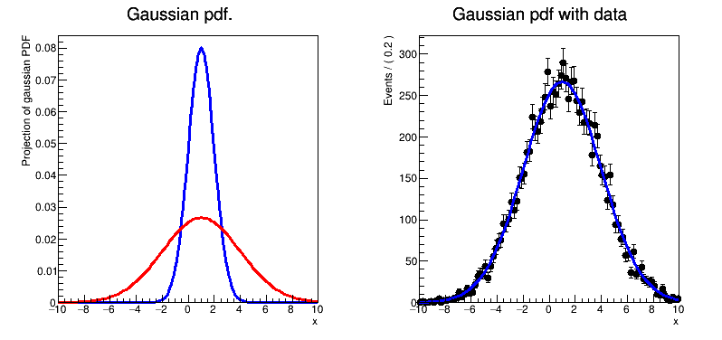

# RooFit基本用法

## 使用、定义的RooFit类

[RooRealVar](https://root.cern/doc/master/classRooRealVar.html)：表示可以从外部更改的变量

常用的构造函数：
```cpp
RooRealVar (const char *name, const char *title, Double_t minValue, Double_t maxValue, const char *unit="")

RooRealVar (const char *name, const char *title, Double_t value, Double_t minValue, Double_t maxValue, const char *unit="")
```

[RooDataSet](https://root.cern/doc/master/classRooDataSet.html)：是一个容器类来保存未分箱的数据

在 RooDataSet 中，N 维空间中的每个数据点都由 RooRealVar、RooCategory 或 RooStringVar 对象的 RooArgSet 表示，可以使用 get() 检索这些对象

[RooGaussian](https://root.cern/doc/master/classRooGaussian.html)：高斯概率密度函数

常用的构造函数：
```cpp
RooGaussian (const char *name, const char *title, RooAbsReal &_x, RooAbsReal &_mean, RooAbsReal &_sigma)

RooGaussian (const RooGaussian &other, const char *name=0)
```

[RooPlot](https://root.cern/doc/master/classRooPlot.html)：是一个绘图框架和该框架内图形对象的容器

作为一个框架，它提供了` TH1 `风格的公共接口，用于设置绘图范围、配置轴等。作为一个容器，它包含一组任意对象，这些对象可能是数据的直方图、表示拟合模型的曲线或文本标签。 使用` Draw() `方法绘制一个框架及其包含的对象。 使用各种` add...() `方法来添加要绘制的对象。 通常，`add...() `方法会创建您传递给它们的对象的私有副本，并返回指向该副本的指针。 调用者拥有输入对象，而此类拥有返回的对象。 所有 `RooAbsReal `和` RooAbsData `派生类都实现了` plotOn() `函数，这些函数有助于在给定的` RooPlot `上绘制自己。

这些高级函数还负责将多维对象绘制到一维图上所需的任何投影或其他映射。

## 代码释义
1、创建变量
```cpp
RooRealVar x("x", "x", -10, 10);
RooRealVar mean("mean", "mean of gaussian", 1, -10, 10);
RooRealVar sigma("sigma", "width of gaussian", 1, 0.1, 10);
```

2、创建高斯函数
```cpp
RooGaussian gauss("gauss", "gaussian PDF", x, mean, sigma);
```

3、以`x`为坐标构图
```cpp
RooPlot *xframe = x.frame(Title("Gaussian pdf."));
```

4、将高斯概率密度函数绘制在`xframe`图上
```cpp
gauss.plotOn(xframe);
```

5、改变`sigma`的值
```cpp
sigma.setVal(3);
```

6、将改变参数的高斯函数以不同颜色绘制在`xframe`上
```cpp
gauss.plotOn(xframe, LineColor(kRed));
```

7、创建一组数据集合，使用高斯函数填充10000个数据
```cpp
RooDataSet *data = gauss.generate(x, 10000);
```

8、构建第二个绘图板
```cpp
RooPlot *xframe2 = x.frame(Title("Gaussian pdf with data"));
```

9、将`date`数据绘制在`xframe2`上
```cpp
data->plotOn(xframe2);
```

10、将高斯函数绘制在`xframe2`上
```cpp
gauss->plotOn(xframe2);
```

11、采用高斯函数拟合`date`数据
```cpp
gauss.fitTo(*data);
```

12、将拟合数据打印至屏幕
```cpp
mean.Print();
sigma.Print();
```

13、创建画板，绘制
```cpp
TCanvas *c = new TCanvas("rf101_basics", "rf101_basics", 800, 400);
c->Divide(2);
c->cd(1);
gPad->SetLeftMargin(0.15);
xframe->GetYaxis()->SetTitleOffset(1.6);
xframe->Draw();
c->cd(2);
gPad->SetLeftMargin(0.15);
xframe2->GetYaxis()->SetTitleOffset(1.6);
xframe2->Draw();
```



code link:[https://github.com/root-project/root/blob/master/tutorials/roofit/rf101_basics.C](https://github.com/root-project/root/blob/master/tutorials/roofit/rf101_basics.C)